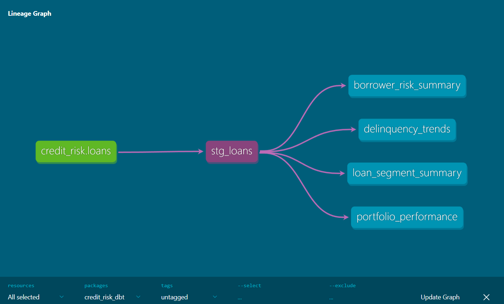
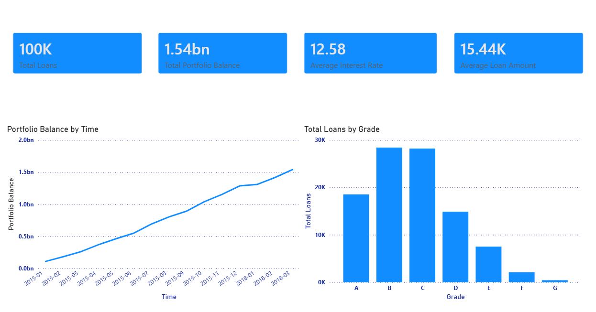
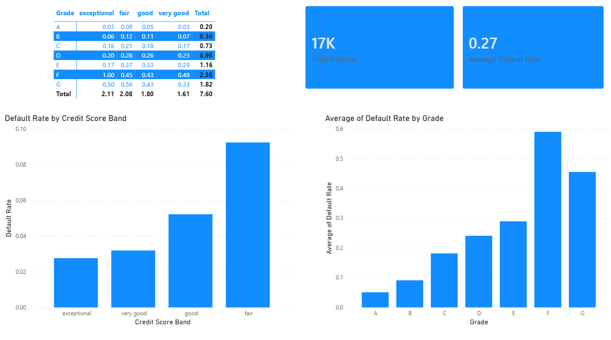
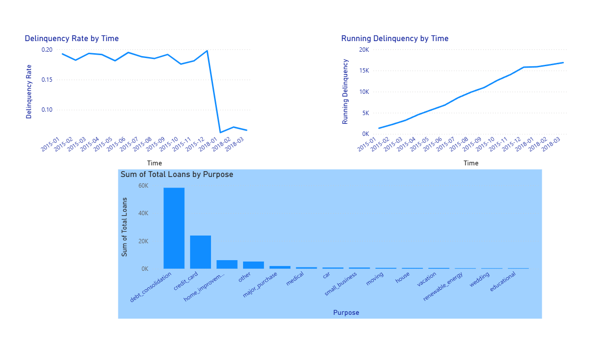
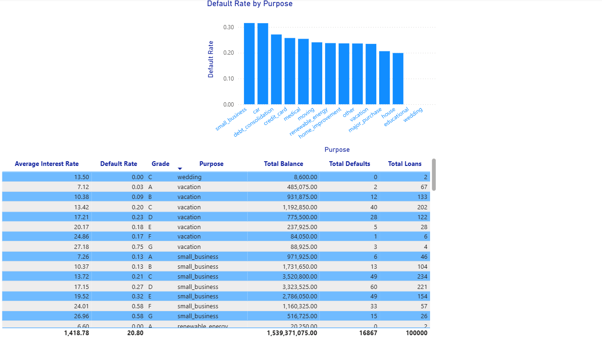

# Credit Risk Analytics Pipeline

An end-to-end cloud analytics pipeline built on AWS that ingests 
100,000 LendingClub loan records, models credit risk with dbt, 
and surfaces delinquency, default, and portfolio exposure insights 
through an interactive Power BI dashboard.

## About
This project demonstrates a complete analytics engineering workflow 
on AWS — from raw data ingestion to cloud storage, serverless SQL, 
tested dbt models, and business intelligence dashboards. Built to 
showcase data engineering skills for fintech, banking, and analytics 
roles. Dataset covers LendingClub loans from 2015–2018 across 
multiple borrower segments, credit grades, and loan purposes.

## Business Questions Answered
- Which borrower segments have the highest default risk?
- How does delinquency vary by credit score band and loan grade?
- How has portfolio balance grown over time?
- Which loan purposes carry the most risk exposure?

## Key Insights
- Overall default rate: 16.9% across 100,000 loans
- Grade F loans have a ~60% average default rate vs 6% for Grade A
- Small business loans carry the highest default risk by purpose
- Fair credit borrowers pay 14.47% avg interest vs 7.71% for exceptional
- Portfolio grew from $106M in Jan 2015 to $1.54B cumulative by 2018

## AWS Architecture
Raw CSV → Python Cleaning → Amazon S3 → Amazon Athena → 
dbt Core → Power BI Dashboard

## Tech Stack
- Python (pandas, boto3, SQLAlchemy)
- Amazon S3 — cloud data lake storage
- Amazon Athena — serverless SQL on S3
- dbt Core + dbt-athena adapter
- Power BI — dashboard layer
- Git / GitHub

## Lineage Graph


## Dashboard
### Portfolio Overview


### Credit Risk


### Delinquency Trends


### Segment Analysis


## dbt Models
### Staging
- `stg_loans` — cleaned and standardized loan records from S3 source

### Marts
- `borrower_risk_summary` — default rate by credit score band and grade
- `delinquency_trends` — monthly delinquency counts and rates with 
  running total
- `portfolio_performance` — monthly portfolio balance and growth over time
- `loan_segment_summary` — risk breakdown by loan purpose and grade

## Setup Instructions

### 1. Clone the repo
```bash
git clone https://github.com/CodeMorera/credit-risk-analytics-pipeline.git
```

### 2. Create virtual environment
```bash
python -m venv .venv
source .venv/Scripts/activate
pip install -r requirements.txt
```

### 3. Configure AWS credentials
Create a `.env` file in the root folder:
```env
AWS_ACCESS_KEY_ID=your_access_key
AWS_SECRET_ACCESS_KEY=your_secret_key
AWS_DEFAULT_REGION=us-east-1
S3_BUCKET_NAME=credit-risk-pipeline-cmorera
```
### 4. Run the pipeline
```bash
python src/clean.py
python src/upload.py
```

### 5. Create Athena table
Run the SQL in `src/create_athena_table.sql` in the Athena console

### 6. Run dbt models
```bash
cd credit_risk_dbt
dbt run
dbt test
```

### 7. Connect Power BI
Install Amazon Athena ODBC driver and connect using IAM credentials

## Data Quality
- 39 passing dbt tests across staging and mart models
- Python assertions validate cleaning logic before S3 upload
- Athena external table validated against source CSV row counts

## Data Source
LendingClub loan dataset from Kaggle — 100,000 records sampled 
from 2015–2018 loan issuances. 100% public data, no PII.


